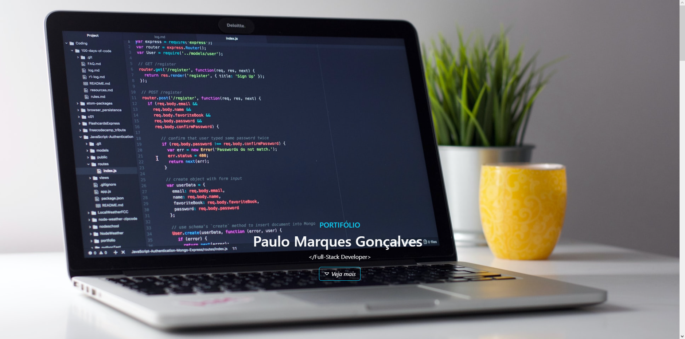

# Site Portfólio



# Índice
- [Site Portfólio](#site-portfólio)
- [Índice](#índice)
- [Sobre](#sobre)
- [Instalação e Utilização](#instalação-e-utilização)
- [Tecnologias Utilizadas](#tecnologias-utilizadas)
- [License](#license)

# Sobre

Eu criei um site de portfólio pessoal que usa as tecnologias HTML 5, CSS 3, JavaScript e Bootstrap 5. Ele tem uma interface responsiva que apresenta meus projetos e habilidades de uma forma organizada e clara. O objetivo é fornecer uma visão geral de minhas realizações e experiência na área. Sinta-se livre para clonar o projeto e adaptar
para seus projetos pessoais ou profissionais.
Teve uma ideia de como melhorar o código? Me manda uma mensagem e vamos conversar.

I created a personal portfolio website using HTML 5, CSS 3, JavaScript, and Bootstrap 5. It has a responsive interface that showcases my projects and skills in an organized and clear manner. The goal is to provide an overview of my accomplishments and experience in the field. Feel free to clone the project and adapt it for your personal or professional projects. Have an idea on how to improve the code? Send me a message and let's talk.

# Instalação e Utilização

```bash
git clone https://github.com/PauloMarquesG/portfolio.git
```

GitHub Pages: https://paulomarquesg.github.io/portfolio/

# Tecnologias Utilizadas
- `HTML 5`
- `CSS 3`
- `BootStrap 5`
- `JavaScript`

# License

[](https://opensource.org/licenses/lgpl-3.0)

<hr>

<a href="https://github.com/PauloMarquesG" style="color:gray;text-decoration:none;">&copy; Copyright 2023. by - Paulo Marques Gonçalves :]</a>
