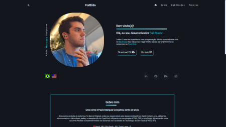

# Web Site Portfólio



# Index
- [About](#about)
- [Installation](#installation)
- [Technologies Used](#technologies-used)
- [License](#license)

# About

Este é o meu portfólio pessoal, um espaço dedicado à exposição dos meus projetos. Busco realizar cada projeto com excelência e paixão, destacando não apenas os resultados finais, mas também o processo criativo envolvido. Além disso, neste espaço, você encontrará uma descrição detalhada das minhas habilidades e das linguagens que domino.

This is my personal portfolio, a dedicated space showcasing my projects. I strive to execute each project with excellence and passion, emphasizing not only the final results but also the creative process involved. Furthermore, within this space, you will find a detailed description of my skills and the programming languages I proficiently command.

# Installation

```bash
git clone https://github.com/PauloMarquesG/portfolio.git
```

# Technologies Used
- `React.js`
- `i18next`

# License

[](https://opensource.org/licenses/lgpl-3.0)

<hr>

<a href="https://paulomarquesg.vercel.app" style="color:gray;text-decoration:none;">&copy; Paulo Marques Gonçalves | All rights reserved.</a>
